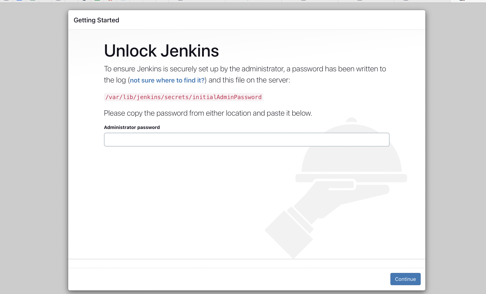
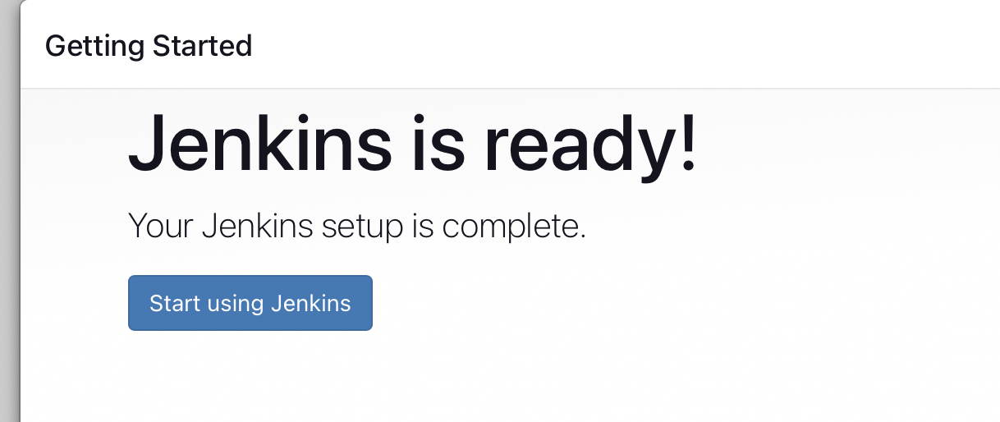
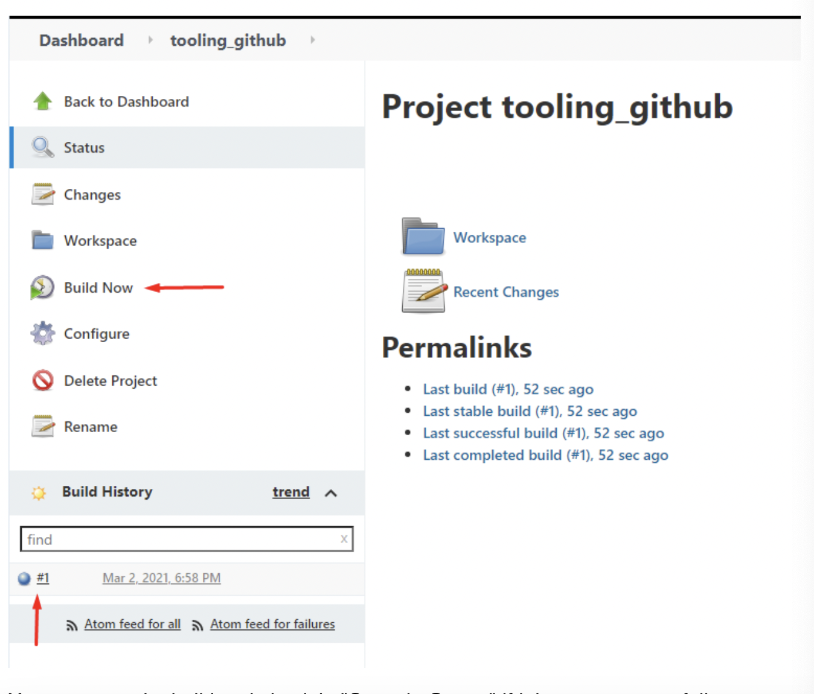
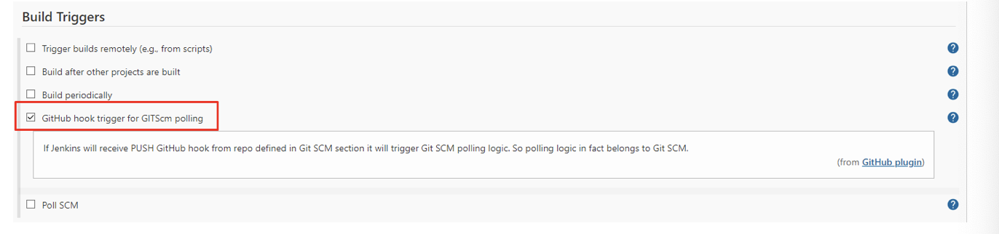
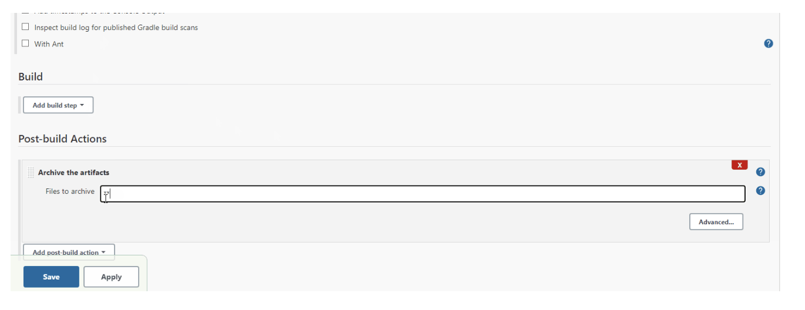
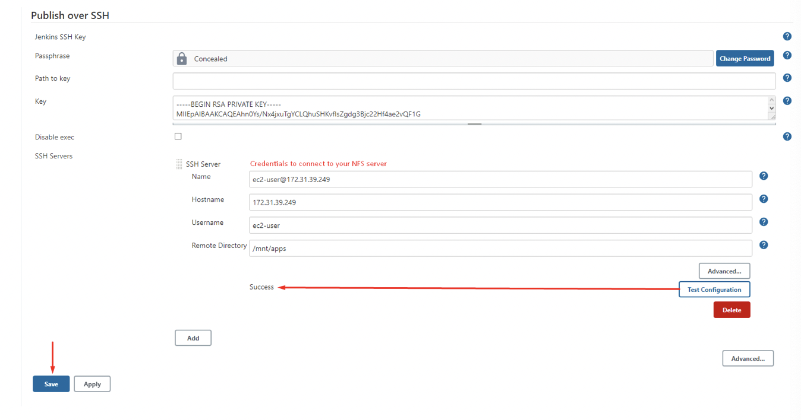

# Project-9
TOOLING WEBSITE DEPLOYMENT AUTOMATION WITH CONTINUOUS INTEGRATION.


- In this project, i enhanced the architecture prepared in Project 8 by adding a Jenkins server, configured a job to automatically deploy source codes changes from Git to NFS server.

Here is what the updated Architechture will look like upon completion;


1. Create an AWS EC2 server

2. Install Java Development Kit

```
sudo apt update
sudo apt install default-jdk-headless
```

3. Install Jenkins

```
curl -fsSL https://pkg.jenkins.io/debian-stable/jenkins.io-2023.key | sudo tee \
  /usr/share/keyrings/jenkins-keyring.asc > /dev/null
echo deb [signed-by=/usr/share/keyrings/jenkins-keyring.asc] \
  https://pkg.jenkins.io/debian-stable binary/ | sudo tee \
  /etc/apt/sources.list.d/jenkins.list > /dev/null
sudo apt-get update
sudo apt-get install jenkins
```

`sudo systemctl status jenkins`

4. By default Jenkins server uses TCP port 8080 – open it by creating a new Inbound Rule in your EC2 Security Group

5. Perform initial Jenkins setup.

From your browser access http://`<Jenkins-Server-Public-IP-Address-or-Public-DNS-Name>`:8080

You will be prompted to provide a default admin password



- Retrieve it from your server

`sudo cat /var/lib/jenkins/secrets/initialAdminPassword`

- Then you will be asked which plugings to install – choose suggested plugins.

- Once plugins installation is done – create an admin user and you will get your Jenkins server address.




## Step 2 – Configure Jenkins to retrieve source codes from GitHub using Webhooks

1. Enable webhooks in your GitHub repository settings


2. Go to Jenkins web console, click "New Item" and create a "Freestyle project"


- To connect your GitHub repository, you will need to provide its URL, you can copy from the repository itself

- In configuration of your Jenkins freestyle project choose Git repository, provide there the link to your Tooling GitHub repository and credentials (user/password) so Jenkins could access files in the repository.

- Save configuration and  to run the build manually.
Click "Build Now" button and should be under #1



- You can open the build and check in "Console Output" if it has run successfully.


3. Click "Configure" your job/project and add these two configurations

- Configure triggering the job from GitHub webhook:



- Configure "Post-build Actions" to archive all the files – files resulted from a build are called "artifacts"



- Now, we can go ahead and make some change in any file in our GitHub repository (e.g. README.MD file) and push the changes to the master branch.

- A new build has been launched automatically (by webhook) and you can see its results – artifacts, saved on Jenkins server


- An automated Jenkins job that receives files from GitHub by webhook trigger has been configured(this method is considered as ‘push’ because the changes are being ‘pushed’ and files transfer is initiated by GitHub) 

- By default, the artifacts are stored on Jenkins server locally

`ls /var/lib/jenkins/jobs/tooling_github/builds/<build_number>/archive/`


### STEP 3

Configure Jenkins to copy files to NFS server via SSH

- Now we have our artifacts saved locally on Jenkins server, the next step is to copy them to our NFS server to `/mnt/apps` directory

1. Install "Publish Over SSH" plugin.

- On main dashboard select "Manage Jenkins" and choose "Manage Plugins" menu item.

On "Available" tab search for "Publish Over SSH" plugin and install it.


2. Configure the job/project to copy artifacts over to NFS server.

- On main dashboard select "Manage Jenkins" and choose "Configure System" menu item

- Scroll down to Publish over SSH plugin configuration section and configure it to be able to connect to your NFS server:

1. Provide a private key (content of .pem file that you use to connect to NFS server via SSH/Putty)
2. Arbitrary name
3. Hostname – can be `private IP address` of your NFS server
4. Username – `ec2-user` (since our NFS server is based on EC2 with RHEL 8)
5. Remote directory – `/mnt/apps` since our Web Servers use it as a mointing point to retrieve files from the NFS server

- Test the configuration and make sure the connection returns Success. Remember, that TCP port 22 on NFS server must be open to receive SSH connections.



- Save the configuration, open your Jenkins job/project configuration page and add another one "Post-build Action"


- Configure it to send all files produced by the build into our previouslys define remote directory. In our case we want to copy all files and directories – so we use **


- Save this configuration and go ahead, change something in README.MD file in your GitHub Tooling repository.

- Webhook will trigger a new job and in the "Console Output" of the job you will find something like this;


- To make sure that the files in /mnt/apps have been udated – connect via SSH/Putty to your NFS server and check README.MD file

`cat /mnt/apps/README.md`


- If you see the changes you had previously made in your GitHub – the job works as expected.


# **THANK YOU!!**

